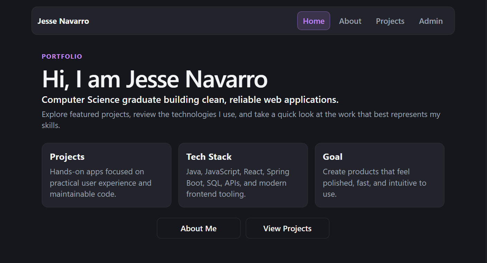
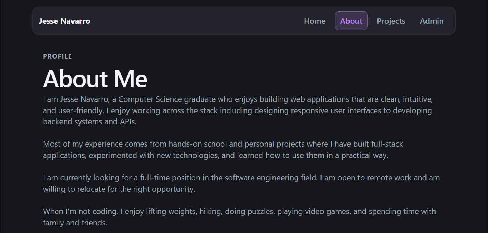
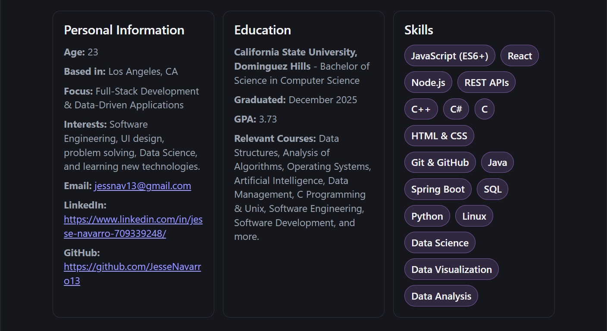
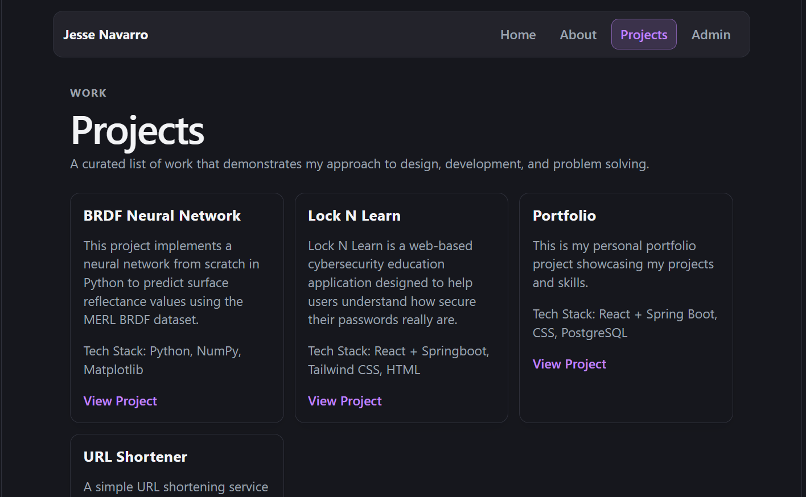
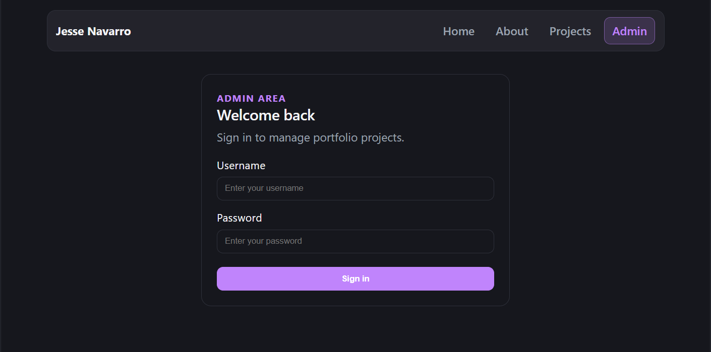
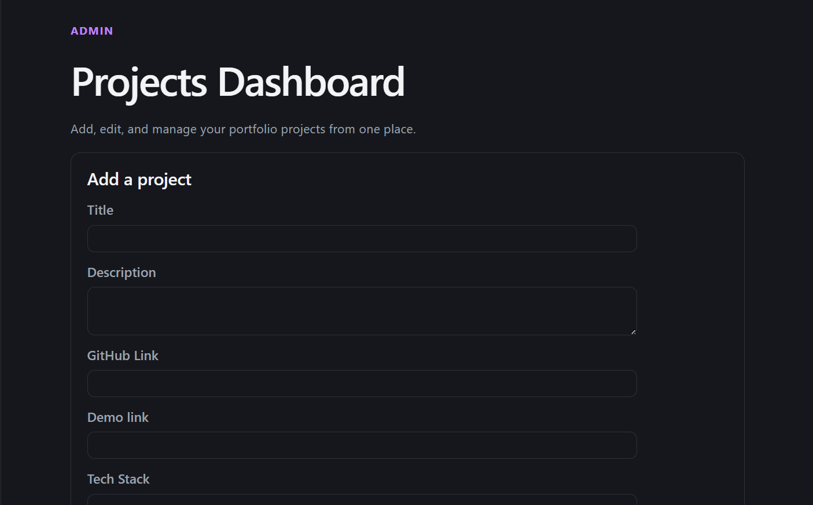
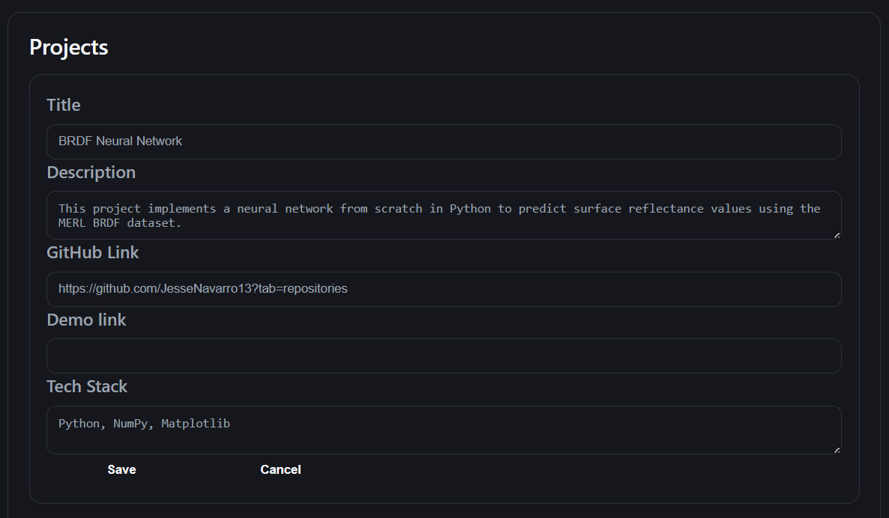

# 🌐 Portfolio Website

  

This is my personal full-stack portfolio application showcasing my projects and skills. Built with **React** for the frontend and **Spring Boot** for the backend, featuring **JWT-based authentication** and **PostgreSQL** for persistent data storage.

---

## 📸 Screenshots

### Home Page

### About Page

### Projects Page

### Admin Login

### Admin Dashboard

---

## ✨ Features
- **Home Page** - Introduction and overview of my background and work.
- **About Page** - Information about my background, skills, and experience.
- **Projects Page** - Displays featured projects in a responsive card layout.
- **Admin Dashboard** - Login-protected dashboard for managing projects (CRUD operations).
- **Authentication** - Secure admin login implemented using JWT tokens.
- **Backend API** - RESTful API built with Spring Boot to handle project data and authentication.
- **Database Integration** - PostgreSQL database used for persistent storage of project data.
- **Responsive Design** - Fully responsive UI optimized for desktop and mobile devices.

---

## 🧰 Tech Stack
**Frontend:** 
- React
- React Router DOM
- Vite
- CSS / Tailwind CSS
  
**Backend:** 
- Spring Boot
- Spring Security (JWT Authentication)
- REST API

**Database:**
- PostgreSQL

**Development Tools:**
- Git
- GitHub
- VS Code
- Maven
- Node.js

---

## 🚀 TODO / Improvements

- Add user management system
- Improve UI/UX polish and animations
- Add project filtering and search
- Deploy full-stack app

---

## 📌 Notes

This project was built to demonstrate full-stack development skills, including:

- Authentication & security (JWT)
- REST API design
- Database management/integration
- Frontend state management
- Responsive UI design
